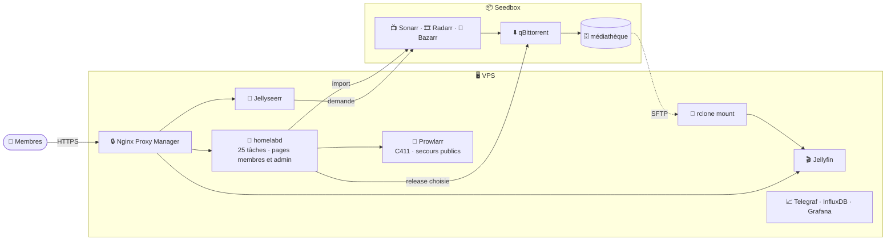

<div align="center">

<picture>
  <source media="(prefers-color-scheme: dark)" srcset="branding/jellyfin/logo/banner-dark.png">
  <source media="(prefers-color-scheme: light)" srcset="branding/jellyfin/logo/banner-light.png">
  
</picture>

### 🎬 Le streaming privé d'une petite communauté, automatisé de bout en bout

[](https://github.com/HaradasCYB/groscailloux-homelab/actions/workflows/rust.yml)
[](https://github.com/HaradasCYB/groscailloux-homelab/actions/workflows/compose-validate.yml)
[](https://github.com/HaradasCYB/groscailloux-homelab/actions/workflows/shellcheck.yml)
<br>


[](LICENSE)

[✨ Fonctionnalités](#-fonctionnalités) ·
[🗺️ Architecture](#️-architecture) ·
[🚀 Démarrage](#-démarrage-rapide) ·
[🛠️ Exploitation](#️-exploitation-au-quotidien) ·
[📚 Documentation](#-documentation) ·
[📝 Versions](CHANGELOG.md)

</div>

---

Deux machines, une seule plateforme : un **VPS** sert la lecture (Jellyfin, Jellyseerr, Nginx Proxy Manager,
observabilité, bureau distant, bibliothèque historique) et une **seedbox** fait tous les téléchargements (qBittorrent,
Radarr, Sonarr, Bazarr), montée sur le VPS par rclone. Entre les deux, un daemon Rust unique, **`homelabd`**, piloté
par **`homelabctl`**, fait tout le travail que personne n'a envie de faire à la main.

## ✨ Fonctionnalités

<table>
<tr>
<td width="50%" valign="top">

**🍿 Côté membres**

- 🙋 **Demander** un film ou une série depuis Jellyfin (Jellyseerr intégré), suivre l'**avancement** sur sa carte
- 🇫🇷 **Français d'abord** : VF, MULTi, VOSTFR ; animés en **MULTi > VOSTFR**, mode « Toujours en VO » au choix
- 📺 **Télés** : interface dédiée (LG, Samsung), télécommande, sous-titres lisibles depuis le canapé
- 📱 **Diffusion** : Chromecast et AirPlay, sous-titres compris
- 👤 **Mon compte** : abonnement, appareils, langue, taille des sous-titres
- 💬 **Tchat** des membres et annonces, aussi sur Discord

</td>
<td width="50%" valign="top">

**🧰 Côté admin**

- 🔎 **Recherche par identifiant TMDB** (C411), une saison entière en une requête, budget horaire par clé
- 🛟 **Secours public** automatique quand C411 est en panne (Nyaa pour les animés, World-torrent)
- 📥 **Imports** propres : liens physiques, jamais de fichier incomplet, numérotation absolue des animés
- 🗜️ **Stockage** : x265 et audio léger préférés, plafonds de taille, remplacement des fichiers trop lourds
- 🩺 **Surveillance** : santé des conteneurs, canari de lecture, chien de garde du montage, alertes mail + Discord
- 🔐 **Comptes** : inscription, lien de bienvenue, abonnements PayPal, limites de lecture

</td>
</tr>
</table>

## 🗺️ Architecture



Schémas détaillés (parcours d'une demande, stockage, réseau) : [docs/INFRA.md](docs/INFRA.md).

## 🧩 Composants

| | Composant | Rôle |
|---|---|---|
| 🦀 | **homelabd** / **homelabctl** | Daemon Rust (`crates/`) : recherches, imports, sous-titres, comptes, abonnements, pages, tchat |
| 🎬 | **Jellyfin** | Lecture, thème « Groscailloux TV » (`branding/jellyfin/`), scripts injectés |
| 🙋 | **Jellyseerr** | Demandes des membres, validation automatique, quotas |
| 📺 🎞️ | **Sonarr · Radarr** | Fiches, profils de qualité français, imports (seedbox) |
| ⬇️ | **qBittorrent** | Téléchargements (seedbox), ratio par tracker |
| 🔎 | **Prowlarr** | C411 (deux clés), Nyaa et World-torrent en secours |
| 🔒 | **Nginx Proxy Manager** | TLS, seul point d'entrée public |
| 📈 | **Telegraf · InfluxDB · Grafana · diun** | Métriques, tableaux de bord, alertes de nouvelles images |
| 🖥️ | **Homarr · Portainer · Guacamole** | Tableau de bord, conteneurs, bureau distant |

## 🚀 Démarrage rapide

```bash
git clone https://github.com/HaradasCYB/groscailloux-homelab.git /opt/homelab
cd /opt/homelab && cp .env.example .env && chmod 600 .env && nano .env   # voir docs/SECRETS.md
sudo ./setup.sh                 # ou --from-source pour compiler homelabd localement
homelabctl check                # chaque service répond avec les clés fournies
```

Pas à pas complet : [docs/DEPLOY.md](docs/DEPLOY.md). Arrivée d'un nouveau membre : [docs/ONBOARDING.md](docs/ONBOARDING.md).

## 🛠️ Exploitation au quotidien

```bash
docker compose ps                         # état + healthchecks
docker compose config --quiet             # valider avant tout up -d
docker compose up -d <service>            # appliquer une modification du compose

journalctl -u homelabd -f                 # logs des tâches (run_done task=… summary=…)
homelabctl status                         # dernier passage de chaque tâche
homelabctl run <tâche> [--dry-run]        # un passage exécuté par le démon (--dry-run : local, sans écriture)
homelabctl onboard <user> <email>         # compte Jellyfin + Jellyseerr + mail avec lien de bienvenue
homelabctl accounts list|on|off|link      # comptes des membres (on/off/delete passent par le démon)
homelabctl vpn status|on|off              # qBittorrent via gluetun ou en direct
sudo homelabctl backup                    # état → backups/ (aussi chaque dimanche 04:40, archive testée)
```

<details>
<summary>🔄 Mettre à jour une image ou homelabd</summary>

**Image** : diun envoie un mail quand un nouveau tag existe. Changer `tag@sha256` dans `docker-compose.yml`,
`docker compose pull <svc> && docker compose up -d <svc>`, commit.

**homelabd** : `cargo build --release --target x86_64-unknown-linux-musl`,
`sudo install target/x86_64-unknown-linux-musl/release/homelab{d,ctl} /usr/local/bin/`,
`sudo systemctl restart homelabd`. Ou un tag `v2.x.y` → release GitHub → `sudo ./setup.sh`.
Une clé ajoutée à `homelab.toml` est refusée par l'ancien binaire (`deny_unknown_fields`) : installer le nouveau
avant tout redémarrage. Un test vérifie que les valeurs par défaut du code sont celles de `homelab.toml`.

</details>

<details>
<summary>🔌 Ports</summary>

Tous les services passent par Nginx Proxy Manager (80/443). Les ports des conteneurs ne sont publiés que sur
`127.0.0.1` : Docker contourne ufw, un port publié sur toutes les interfaces serait joignable depuis Internet.

| Service | Port (127.0.0.1) | Service | Port (127.0.0.1) |
|---|---|---|---|
| Jellyfin | 8096 | Jellyseerr | 5055 |
| Sonarr | 8989 | Radarr | 7878 |
| Prowlarr | 9696 | qBittorrent (via gluetun) | 8080 |
| pyLoad | 8000 | Homarr | 7575 |
| Grafana | 3000 | InfluxDB | 8086 |
| Portainer | 9000 | Glances | 61208 |
| Guacamole | 8081 | NPM (public) | 80 / 443, admin 81 |
| BitTorrent (public) | 6881 | homelabd (hôte : pages, API, /health) | 8766 |

</details>

## 📚 Documentation

| | Document | Contenu |
|---|---|---|
| 🗺️ | [docs/INFRA.md](docs/INFRA.md) | Vue d'ensemble avec schémas : machines, parcours d'une demande, stockage |
| 🏗️ | [docs/ARCHITECTURE.md](docs/ARCHITECTURE.md) | Architecture et flux de données |
| ⚙️ | [docs/AUTOMATION.md](docs/AUTOMATION.md) | Chaque tâche de homelabd, ses endpoints et ses garde-fous |
| 🚀 | [docs/DEPLOY.md](docs/DEPLOY.md) | Déploiement d'un hôte neuf, procédures |
| 🔑 | [docs/SECRETS.md](docs/SECRETS.md) | Chaque variable de `.env` (aucune valeur ici) |
| 👋 | [docs/ONBOARDING.md](docs/ONBOARDING.md) | Arrivée d'un membre, côté admin |
| 📝 | [CHANGELOG.md](CHANGELOG.md) | Historique des versions |
| 🤖 | [CLAUDE.md](CLAUDE.md) | Règles d'exploitation et pièges connus (lu par l'agent qui opère le serveur) |

## 🗂️ Structure du dépôt

```
📦 groscailloux-homelab
├── 🦀 crates/               homelab-core (logique), homelabd (daemon), homelabctl (CLI)
├── 🎨 branding/jellyfin/    thème (calque CSS), scripts injectés (qualité, AirPlay, langue, TV), logo
├── 📚 docs/                 documentation (voir ci-dessus)
├── ⚙️ systemd/              homelabd, pile Docker, sauvegarde, montage seedbox et son chien de garde
├── 🧰 scripts/              outils ponctuels (branding, scripts injectés, déménagement, ménage seedbox)
├── 🪝 hooks/                qbit-update-port.sh, lancé par gluetun à chaque port transféré
├── 🐳 docker-compose.yml    21 services, images épinglées tag@digest, healthchecks, ports sur 127.0.0.1
├── 🧾 homelab.toml          configuration de homelabd (intervalles, seuils, chemins)
├── 🔐 .env.example          modèle des secrets (le vrai .env n'est jamais commité)
├── 🧪 setup.sh              installation idempotente d'un hôte neuf
└── 🔔 diun/images.yml       images surveillées
```

## 🦾 La mascotte

<div align="center">

<br>
<sub><i>Le gros caillou en personne, fidèle au poste.</i></sub>
</div>

## 📜 Licence

[MIT](LICENSE).
