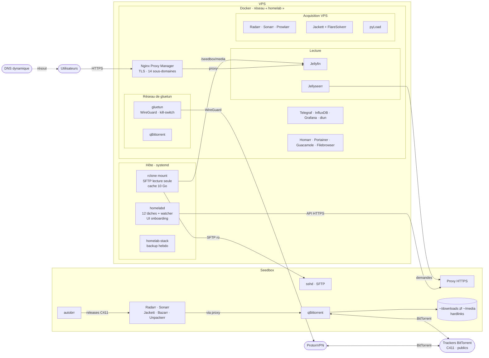
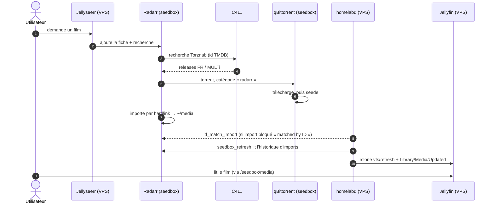
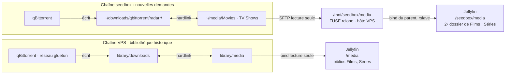

# Infrastructure : fonctionnement complet

Deux machines, un seul Jellyfin. La **seedbox** télécharge et stocke les nouvelles demandes ; le
**VPS** diffuse, automatise et surveille. Ce document montre qui fait quoi, par où passent les
fichiers et ce qui se passe quand un élément tombe.

> Version publique : ni adresse, ni nom d'hôte, ni détail d'exposition réseau. Le détail physique
> complet est tenu à jour dans une page privée, hors dépôt.

| | VPS | Seedbox |
|---|---|---|
| Rôle | diffusion, automatisation, pipeline historique | acquisition et stockage des nouvelles demandes |
| Machine | VPS dédié · Ubuntu 26.04 · 6 vCPU · 17 Go · pas de GPU | seedbox partagée (plateforme Ultra.cc) · pas de root |
| Stockage | 969 Go ext4 (médias + téléchargements + état des services) | 3,7 To de quota |
| Services | 23 conteneurs Docker + `homelabd` (Rust) sur l'hôte | qBittorrent, autobrr (natifs) · Radarr, Sonarr, Jackett, FlareSolverr, Bazarr, Unpackerr (conteneurs) |

Lien entre les deux : latence ~96 ms, ~12 Mo/s par lecture ; API en HTTPS, fichiers en SFTP lecture seule.

## Architecture physique



- **NPM** est l'entrée prévue : il termine le TLS et renvoie chaque sous-domaine vers un conteneur.
  Les conteneurs du VPS s'appellent par leur nom (`http://radarr:7878`).
- **qBittorrent (VPS)** n'a pas de réseau propre : il vit dans celui de gluetun et ne sort que par
  le tunnel VPN. Un hook de gluetun lui pousse le port attribué par le VPN.
- **Seedbox** : les applis en conteneurs voient le dossier personnel au même chemin que
  qBittorrent (natif), ce qui permet les hardlinks ; elles joignent qBittorrent par le proxy HTTPS
  de l'hébergeur.

## Parcours d'une demande

Jellyseerr envoie les nouvelles demandes aux Radarr/Sonarr **de la seedbox** (serveurs par défaut) ;
ceux du VPS gèrent la bibliothèque existante. Sur les quatre Arrs, **seul C411** sert aux grabs
automatiques (RSS, recherche à l'ajout) ; les autres indexers ne servent qu'en recherche manuelle.
Qualité : 1080p au plus, jamais de 4K (le VPS transcode sans GPU).



Délai entre la fin du téléchargement et l'apparition dans Jellyfin : 10 minutes au pire (deux tâches
à 5 minutes). autobrr peut aussi déclencher l'envoi du torrent dès qu'une release C411 sort.

**Pourquoi `id_match_import`** : les releases C411 portent souvent le titre français, que Radarr ne
relie pas à sa fiche anglaise. L'indexeur ayant fourni l'id TMDB, Radarr sait de quel film il
s'agit, mais bloque l'import par précaution ; la tâche le débloque pour les seuls fichiers sans
autre rejet.

## Stockage

Un fichier téléchargé n'existe qu'une fois sur le disque, sous deux chemins (**hardlink**) : le
dossier de téléchargement, où le torrent seede, et la bibliothèque rangée. Supprimer le torrent ne
supprime pas le film.



- **Dossier parent** : rclone monte dans `/mnt/seedbox/media`, mais Jellyfin lie `/mnt/seedbox`
  (dossier ordinaire) avec `rslave`. Chaque (re)montage apparaît dans le conteneur sans le recréer ;
  lier le point de montage lui-même laisserait un montage mort après une coupure.
- **Sauvegardes** : `homelabctl backup` (dimanche 04:30) archive l'état du VPS (configs, `.env`,
  dump MySQL de Guacamole, unités systemd), 4 archives gardées. Les médias ne sont pas sauvegardés
  (trop volumineux, re-téléchargeables), pas plus que la config des applis de la seedbox.

## Autres flux

| Flux | Fonctionnement |
|---|---|
| Pipeline historique (VPS) | Radarr/Sonarr du VPS → Jackett (+ FlareSolverr) et C411 → qBittorrent via gluetun → import hardlink dans `library/media`. C411 seul en automatique, les autres indexers en recherche manuelle. |
| Torrents ajoutés à la main (VPS + seedbox) | `torrent_import` (10 min) : torrent terminé inconnu des Arrs → fiche non surveillée → import manuel en hardlink → Jellyfin. Refusé si le titre a déjà des fichiers sur l'autre machine. |
| Dépôts directs (VPS) | Fichier dans `library/downloads` (pyLoad, dépôt manuel) → observateur `auto_import` → classement série/film → ajout de la fiche dans l'Arr → import. Archives extraites d'abord. |
| Onboarding | `homelabctl onboard`, page d'onboarding (jeton) ou compte créé dans Jellyseerr → compte Jellyfin (bibliothèques autorisées), import Jellyseerr, mail de bienvenue. Mot de passe jamais journalisé. Le compte arrive suspendu, à activer. |
| Comptes premium | Page « Comptes » (admin) ou `homelabctl accounts` : premium = compte Jellyfin actif, sinon suspendu (connexion refusée, rien de supprimé). 25 comptes premium et 2 lectures simultanées par compte au plus. |
| Observabilité | Telegraf (hôte + Docker) → InfluxDB (30 jours) → Grafana ; Glances en direct. |
| Mises à jour | Images figées `tag@sha256` ; diun signale chaque jour les nouvelles versions par mail ; la mise à jour reste manuelle. |

## Automatisation

Tout passe par `homelabd` (un binaire, un service systemd, `homelab.toml` + `.env`). Chaque tâche
démarre au lancement du démon puis tourne à son rythme ; un verrou sérialise les modifications de
qBittorrent. Détail des endpoints : [AUTOMATION.md](../AUTOMATION.md).

| Tâche | Rythme | Rôle | Garde-fou |
|---|---|---|---|
| `stack_health` | 5 min | relance les services arrêtés, redémarre les unhealthy, teste Guacamole | 10 min entre deux redémarrages, attend guacdb |
| `seedbox_refresh` | 5 min | nouveaux imports seedbox → rclone + Jellyfin | curseur persistant ; rien si montage absent |
| `id_match_import` | 5 min | débloque les imports « matched by ID » | fichiers sans rejet ; 10 max/passage |
| `unknown_series_grab` | 6 h | prend les releases C411 au titre traduit que Sonarr ne reconnaît pas | titre identique au titre FR ou original ; ≤ 1080p ; 3 recherches/passage |
| `torrent_import` | 10 min | importe les torrents ajoutés à la main (VPS + seedbox) | fiches non surveillées, hardlink, pas de doublon entre machines ; 10 max/passage |
| `tba_bypass` | 5 min | importe les épisodes refusés pour « titre TBA » | seul rejet uniquement |
| `stuck_handler` | 5 min | remplace les téléchargements bloqués > 8 h | 5 max/passage, ciblé |
| `disk_pressure` | 15 min | disque VPS ≥ 95 % : supprime les vieux torrents arrêtés | hardlinks préservés ; ≥ 98 % alerte seule |
| `tracker_ratio` | 30 min | limites de partage par tracker | C411 illimité · publics 2 / 14 j · autres 1 / 7 j |
| `monitor_sync` | 10 min | saisons surveillées = saisons demandées | routage par serveur Jellyseerr |
| `user_poller` | 60 s | convertit les comptes créés dans Jellyseerr | une fois par email |
| `cleanup` | 24 h | transcodages, dossiers vides, corbeilles, logs | chemins existants seulement |
| `auto_import` | continu | observe `library/downloads` | refuse de démarrer sans le dossier |

## Lecture fluide

Presque toutes les lectures sont directes (les appareils lisent le fichier tel quel) : ce qui compte est
de livrer le fichier assez vite, et de ne pas faire tourner de tâches lourdes pendant qu'on regarde.

| Levier | Réglage |
|---|---|
| Lien seedbox | SFTP en blocs de 255 Ko : ~16 Mo/s par flux (contre 5), ~24 Mo/s reçus par Jellyfin ; cache de 20 Go, sans lecture anticipée |
| Ajout d'un titre | aucune analyse qui lit la vidéo (Intro Skipper, capture d'image, NFO) : tout passe dans la fenêtre de nuit |
| Vignettes de navigation (trickplay) | images clés seulement, jamais pendant un scan ; tâche nocturne 05:30 (6 h max) |
| Tâches Jellyfin lourdes | scan 05:00, segments 05:15, Intro Skipper 06:00, normalisation audio 07:00 : fenêtre sans lecture 05–13 h |
| Priorité CPU | `cpu_shares` 2048 pour Jellyfin, 512 pour les tâches de fond (n'agit qu'en cas de contention) |
| Charge de fond | Jellyseerr : disponibilité recalculée une fois par nuit ; supervision toutes les 30 s |

## Résilience

| Événement | Comportement | Retour à la normale |
|---|---|---|
| Redémarrage du VPS | Docker relance les conteneurs ; `homelab-stack` lance Guacamole après guacdb ; passe `stack_health`. | automatique |
| Seedbox injoignable | Titres venant de la seedbox affichés mais illisibles, sans purge (Jellyfin ignore un dossier inaccessible) ; nouvelles demandes en attente ; VPS intact. | automatique au retour · arrêt définitif : [DEPLOY.md](../DEPLOY.md) |
| Service unhealthy | Redémarré après 2 min. | automatique |
| Coupure du VPN | Kill-switch : qBittorrent (VPS) sans réseau, aucune fuite. | automatique |
| Disque VPS ≥ 95 % | `disk_pressure` libère de la place. | manuel à ≥ 98 % |
| Mauvaise mise à jour | Images figées, config dans git. | `git checkout` + `docker compose up -d` |

## Sécurité

- Secrets uniquement dans `.env` (600, hors git) ; les archives de sauvegarde le contiennent (600).
- Accès VPS → seedbox : une clé SFTP **lecture seule** pour le montage (`restrict,command="sftp-server -R"`),
  API en HTTPS avec clés.
- Outils d'administration derrière une authentification HTTP NPM (liste « admin-outils ») en plus de leur
  propre connexion ; tableau Homarr d'administration privé (connexion Homarr), tableau public réservé aux spectateurs.
- Entrée web prévue : NPM en HTTPS. Les ports publiés par Docker contournent le pare-feu de l'hôte
  (ufw) : toute nouvelle publication de port dans `docker-compose.yml` est joignable depuis Internet.

## Exploitation

```bash
homelabctl check          # services joignables, montage seedbox présent
homelabctl status         # dernier passage de chaque tâche
homelabctl accounts list  # comptes premium / suspendus
docker compose ps         # conteneurs et healthchecks
journalctl -u homelabd -f # journal des tâches
homelabctl run <tâche> --dry-run
```

Voir aussi : [ARCHITECTURE.md](../ARCHITECTURE.md) · [AUTOMATION.md](../AUTOMATION.md) ·
[DEPLOY.md](../DEPLOY.md) · [SECRETS.md](../SECRETS.md).
