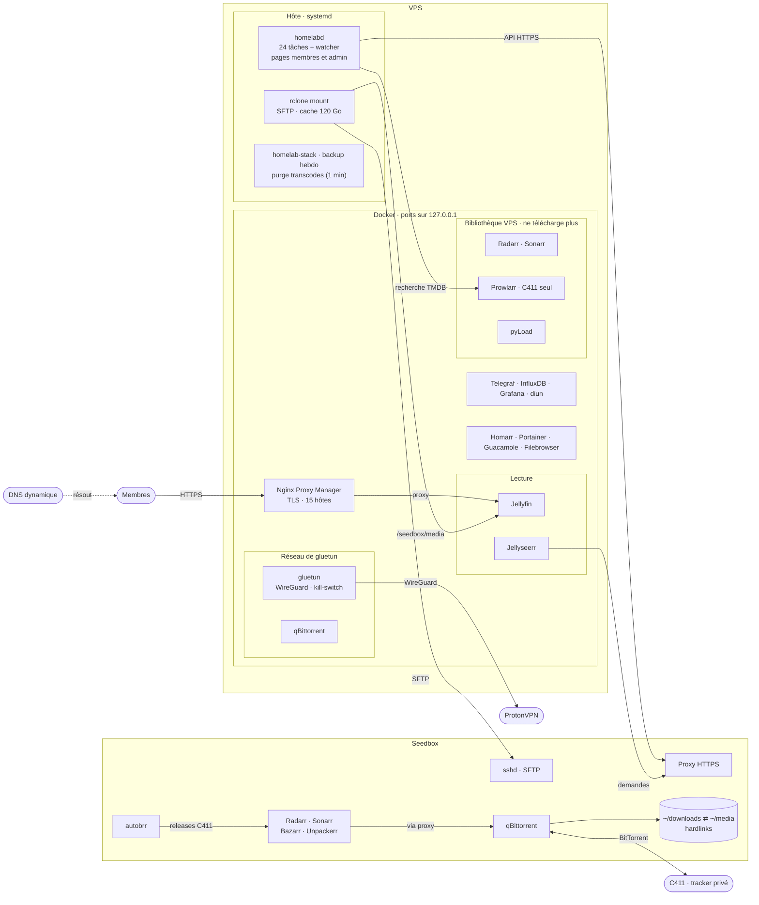
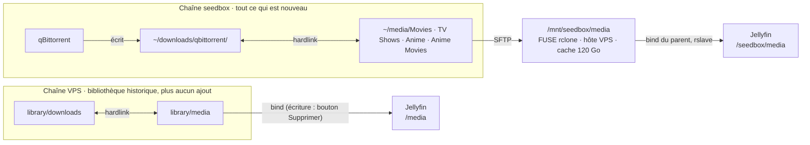

# Infrastructure : fonctionnement complet

Deux machines, un seul Jellyfin. La **seedbox** télécharge et stocke tout ce qui est nouveau ; le **VPS**
diffuse, cherche les releases, automatise, surveille et garde la bibliothèque historique. Ce document montre qui
fait quoi, par où passent les fichiers et ce qui se passe quand un élément tombe. État au 25/09/2026.

> Version publique : ni adresse, ni nom d'hôte, ni détail d'exposition réseau. Le détail physique complet est
> tenu à jour dans une page privée, hors dépôt.

| | VPS | Seedbox |
|---|---|---|
| Rôle | diffusion, recherche, automatisation, bibliothèque historique | tous les téléchargements, stockage des nouveautés |
| Machine | VPS dédié · Ubuntu 26.04 · 6 vCPU · 17 Go + swap 4 Go · pas de GPU | seedbox partagée (plateforme Ultra.cc) · pas de root |
| Stockage | 969 Go ext4 (médias historiques, état des services) | quota de 3,7 To (l'espace libre est celui du quota, pas du disque partagé) |
| Services | 21 conteneurs Docker + `homelabd` (Rust, 24 tâches) sur l'hôte | qBittorrent, autobrr (natifs) · Radarr, Sonarr, Bazarr, Unpackerr (conteneurs) |

Lien entre les deux : latence ~97 ms, 8 à 10 Mo/s par connexion (~30 Mo/s à quatre) ; API en HTTPS, fichiers en
SFTP (lecture + suppression, aucune écriture).

## Architecture physique


```mermaid
flowchart LR
  users([Membres]) -- HTTPS --> npm
  dns([DNS dynamique]) -. résout .-> users

  subgraph VPS
    direction TB
    subgraph host[Hôte · systemd]
      homelabd["homelabd<br/>24 tâches + watcher<br/>pages membres et admin"]
      rclone["rclone mount<br/>SFTP · cache 120 Go"]
      stack["homelab-stack · backup hebdo<br/>purge transcodes (1 min)"]
    end
    subgraph docker[Docker · ports sur 127.0.0.1]
      npm[Nginx Proxy Manager<br/>TLS · 15 hôtes]
      subgraph lecture[Lecture]
        jellyfin[Jellyfin]
        seerr[Jellyseerr]
      end
      subgraph biblio[Bibliothèque VPS · ne télécharge plus]
        arrs[Radarr · Sonarr]
        prowlarr[Prowlarr · C411 seul]
        pyload[pyLoad]
      end
      subgraph netns[Réseau de gluetun]
        gluetun[gluetun<br/>WireGuard · kill-switch]
        qbit[qBittorrent]
      end
      obs[Telegraf · InfluxDB · Grafana · diun]
      admin[Homarr · Portainer · Guacamole · Filebrowser]
    end
  end

  subgraph SB[Seedbox]
    direction TB
    proxy[Proxy HTTPS]
    sshd[sshd · SFTP]
    sbqbit[qBittorrent]
    autobrr[autobrr]
    sbarrs[Radarr · Sonarr<br/>Bazarr · Unpackerr]
    sbstore[("~/downloads ⇄ ~/media<br/>hardlinks")]
  end

  vpn([ProtonVPN])
  trackers([C411 · tracker privé])

  npm -- proxy --> jellyfin
  rclone -- "/seedbox/media" --> jellyfin
  rclone -- SFTP --> sshd
  homelabd -- API HTTPS --> proxy
  homelabd -- recherche TMDB --> prowlarr
  seerr -- demandes --> proxy
  gluetun -- WireGuard --> vpn
  sbqbit <-- BitTorrent --> trackers
  autobrr -- releases C411 --> sbarrs
  sbarrs -- via proxy --> sbqbit
  sbqbit --> sbstore
```

- **NPM** est la seule entrée web : il termine le TLS et renvoie chaque hôte vers un conteneur. Les ports des
  conteneurs ne sont publiés que sur `127.0.0.1` (sauf 80/443 et le port BitTorrent) ; les conteneurs s'appellent
  par leur nom (`http://radarr:7878`).
- **qBittorrent (VPS)** vit dans le réseau de gluetun et ne sort que par le tunnel VPN. Recréer gluetun impose de
  recréer qBittorrent.
- **Seedbox** : les applis en conteneurs voient le dossier personnel au même chemin que qBittorrent (natif), ce qui
  permet les hardlinks ; elles joignent qBittorrent par le proxy HTTPS de l'hébergeur. Les sous-titres incrustés
  sont extraits sur la seedbox (script lancé par ssh), sans relire la vidéo à travers le lien.

## Parcours d'une demande

Jellyseerr envoie chaque demande aux Radarr/Sonarr **de la seedbox**, en leur interdisant de chercher
(`preventSearch`). C'est **homelabd** qui cherche, par l'identifiant TMDB, chez **C411** seul, via Prowlarr : une
recherche d'Arr sur un animé partait en rafale épisode par épisode et bloquait la clé. Le RSS de C411 reste actif
dans les Arrs de la seedbox pour les sorties du jour. Qualité : 1080p au plus, français d'abord (VF, MULTi, VOF…),
VO en dernier recours ; pour les animés, MULTi puis VOSTFR.

```mermaid
sequenceDiagram
  autonumber
  actor U as Membre
  participant JS as Jellyseerr (VPS)
  participant R as Radarr (seedbox)
  participant H as homelabd (VPS)
  participant C as C411 (via Prowlarr)
  participant Q as qBittorrent (seedbox)
  participant JF as Jellyfin (VPS)

  U->>JS: demande un film
  JS->>R: crée la fiche, sans recherche
  H->>C: movie_search : id TMDB
  C-->>H: releases
  H->>H: choisit (français, ≤ 1080p, ≤ 15 Go, sources)
  H->>R: release/push
  R->>Q: .torrent, catégorie « radarr »
  H-->>Q: si Radarr refuse : ajout direct, étiquette homelab:
  Q->>Q: télécharge, puis seede
  R->>R: importe par hardlink → ~/media (ou torrent_import)
  H->>JF: seedbox_refresh : rclone vfs/refresh + Library/Media/Updated
  U->>JF: lit le film ; l'onglet Demandes montre chaque étape
```

- Un film part dans les 5 minutes qui suivent la demande, une série dans les 10. Sans release : nouvel essai après
  72 h (films) ou 24 h (séries), dans un budget de 40 requêtes par heure **et par clé C411** (deux clés, 10
  requêtes réservées à la recherche manuelle `/recherche`). Une clé qui répond 429 est mise de côté 15 min.
- **Séries** : une release par épisode manquant dans le même lot, ou le pack de saison ; épisodes que TheTVDB n'a
  pas encore datés ; cours d'animés publiés sous un autre titre (liste des fichiers du .torrent lue avant
  d'agir) ; œuvres dérivées (mini, OVA, recap) écartées.
- **Films français** sans date numérique, sortis en salle depuis moins de 110 jours : pas de recherche (la VOD
  arrive 4 mois après la salle) ; le membre voit « VOD vers le … ».
- **Imports** : `torrent_import` importe en hardlink tout ce que l'Arr n'a pas demandé lui-même, ne remplace jamais
  un fichier et refuse un titre présent sur l'autre machine ; `id_match_import` débloque les imports « matched by
  ID » (titres français).

## Stockage

Un fichier téléchargé n'existe qu'une fois sur le disque, sous deux chemins (**hardlink**) : le dossier de
téléchargement, où le torrent seede, et la bibliothèque rangée. Supprimer le torrent ne supprime pas le film ;
pour libérer l'espace, il faut retirer le fichier **et** le torrent (et vider la corbeille de l'Arr).


```mermaid
flowchart LR
  subgraph S[Chaîne seedbox · tout ce qui est nouveau]
    direction LR
    sq[qBittorrent] -- écrit --> sd["~/downloads/qbittorrent/"]
    sd <-- hardlink --> sm["~/media/Movies · TV Shows · Anime · Anime Movies"]
  end
  sm -- SFTP --> mnt["/mnt/seedbox/media<br/>FUSE rclone · hôte VPS · cache 120 Go"]
  mnt -- bind du parent, rslave --> jfs["Jellyfin<br/>/seedbox/media"]

  subgraph V[Chaîne VPS · bibliothèque historique, plus aucun ajout]
    direction LR
    vd["library/downloads"] <-- hardlink --> vm["library/media"]
  end
  vm -- bind (écriture : bouton Supprimer) --> jfv["Jellyfin<br/>/media"]
```

- **Dossier parent** : rclone monte dans `/mnt/seedbox/media`, mais Jellyfin lie `/mnt/seedbox` (dossier
  ordinaire) avec `rslave`. Chaque (re)montage apparaît dans le conteneur sans le recréer.
- **Sauvegardes** : `homelabctl backup` (dimanche 04:40) archive l'état du VPS (configs, `.env`, bases SQLite par
  `VACUUM INTO`, dump MySQL de Guacamole, unités systemd), ~3 Go ; l'archive est testée avant qu'on supprime les
  anciennes, 4 sont gardées. Les médias ne sont pas sauvegardés, ni la config des applis de la seedbox. Copie hors
  site : à l'étude.

## Autres flux

| Flux | Fonctionnement |
|---|---|
| Bibliothèque historique (VPS) | Ne prend plus aucune release depuis le 18/09 (`[downloads] auto_sides = ["seedbox"]` + RSS C411 coupé). Garde ses fiches, `torrent_import` et le nettoyage des suppressions. Des titres ont été déménagés vers la seedbox (`scripts/move-to-seedbox.py`, hors pic). |
| Recherche manuelle | Page `/recherche` (admin) : C411 par TMDB dans le budget horaire, Nyaa pour les animés ; toutes les releases sont montrées et marquées, le choix reste à l'admin. |
| Torrents ajoutés à la main | `torrent_import` (2 min) : import manuel en hardlink vers la bonne fiche. |
| Dépôts directs (VPS) | Fichier dans `library/downloads` → observateur `auto_import` → classement série/film → fiche → import. |
| Onboarding | Inscription publique, tuile « Créer un compte » ou `homelabctl onboard` → compte Jellyfin (5 bibliothèques) + Jellyseerr → mail avec lien à usage unique (60 min) pour choisir son mot de passe, puis les premiers pas. Aucun identifiant par mail. Activation à la main. Voir [ONBOARDING.md](ONBOARDING.md). |
| Comptes et abonnements | Page `/accounts` ou `homelabctl accounts|subs` : premium = compte actif (25 au plus, 2 lectures simultanées), suspendu = connexion refusée sans rien supprimer. Abonnements PayPal (webhook vérifié, contrôle quotidien) ; statut « à qualifier » jamais suspendu automatiquement. |
| Côté membres | Mon compte (abonnement, appareils, mot de passe, langue VF/VO, taille des sous-titres, avancement des demandes), tchat intégré, Discord (salon des membres et salon admin), thème « Groscailloux TV », interface allégée sur téléviseur. |
| Suppression depuis Jellyfin | `deletion_cleanup` : fiche Arr, fichiers et torrents (délai C411 respecté), média Jellyseerr libéré ; seulement pour ce qui est en attente ou en cours. |
| Observabilité | Telegraf (hôte, Docker, cache rclone) → InfluxDB (30 j) → Grafana ; page d'état `/status.html` ; alertes par mail et dans le salon Discord admin. |
| Mises à jour | Images figées `tag@sha256` ; diun signale les nouvelles versions ; mise à jour manuelle. |

## Automatisation

Tout passe par `homelabd` (un binaire, un service systemd, `homelab.toml` + `.env`). Une tâche ne tourne jamais
deux fois en même temps ; une erreur imprévue n'arrête qu'un passage. L'état n'est écrit que par le démon
(écriture atomique) : `homelabctl` le lit et lui demande tout changement (`POST /admin/run`, `/admin/accounts`).
Détail : [AUTOMATION.md](AUTOMATION.md).

| Tâche | Rythme | Rôle | Garde-fou |
|---|---|---|---|
| `series_search` | 10 min | saisons et épisodes manquants par TMDB | budget horaire par clé ; 60 épisodes au plus par saison ; pas d'œuvre dérivée |
| `movie_search` | 5 min | films manquants par TMDB | français d'abord, ≤ 1080p, ≤ 15 Go ; attente de la VOD |
| `torrent_import` | 2 min | torrents étiquetés `homelab:` ou ajoutés à la main | hardlink ; jamais de remplacement ; pas de doublon entre machines |
| `id_match_import` | 5 min | imports « matched by ID » | fichiers sans autre rejet |
| `seedbox_refresh` | 5 min | imports seedbox → rclone + Jellyfin | curseur persistant |
| `stuck_handler` | 5 min | téléchargements bloqués > 8 h | 5 max, ciblé |
| `indexer_unblock` | 5 min | lève la pause d'un Arr sur C411 | 1 h après le dernier échec ; 3 fois/24 h au plus |
| `monitor_sync` | 10 min | saisons suivies = saisons demandées | par serveur Jellyseerr |
| `anime_library` | 30 min | range l'animation japonaise (TMDB), type « anime » | tags anime / pas-anime |
| `identity_check` | 30 min | corrige les fiches Jellyfin mal identifiées | 3 par passage, jamais pendant une lecture |
| `subtitle_sync` | 5 min | sous-titres incrustés → fichiers annexes (sur la seedbox) | item revu toutes les 6 h au plus ; gros ASS jamais par défaut |
| `deletion_cleanup` | 5 min | suppressions Jellyfin / Jellyseerr | seulement en attente ou en cours |
| `trending` | 6 h | rangée « Tendances » de l'accueil | titres présents seulement |
| `playback_canary` | 15 min | transcodage réel de deux segments | alerte au premier échec |
| `playback_limit` | 20 s | arrête la 3ᵉ lecture simultanée | comptes protégés exemptés |
| `hls_loop_watch` | 5 min | client qui boucle sur un segment | alerte admin |
| `stack_health` | 5 min | relance les conteneurs arrêtés ou unhealthy | 10 min entre deux relances |
| `disk_pressure` | 15 min | disque VPS ≥ 95 % : vieux torrents arrêtés | hardlinks préservés ; ≥ 98 % alerte |
| `tracker_ratio` | 30 min | limites de partage par tracker | C411 (deux domaines) illimité |
| `cleanup` | 24 h | dossiers vides, corbeilles (14 j), vieux journaux | chemins existants seulement |
| `user_poller` | 60 s | comptes créés dans Jellyseerr → onboarding | une fois par adresse |
| `subscription_cycle` | 1 h | échéances des abonnements | jamais « à qualifier » |
| `subscription_reconcile` | 24 h | abonnements PayPal ↔ base | corrections tracées |
| `tba_bypass` | — | coupée (inutile depuis `episodeTitleRequired = never`) | — |
| `auto_import` | continu | observe `library/downloads` | refuse de démarrer sans le dossier |

## Lecture fluide

| Levier | Réglage |
|---|---|
| Lien seedbox | cache rclone de 120 Go (éviction avant le seuil du disque), blocs de 4 Mo, 32 connexions SFTP |
| Transcodage | un seul transcodage 1080p tient en temps réel (pas de GPU) ; 65 % des lectures sont directes (30 j au 04/10/2026), le Chromecast fait 63 % des conversions vidéo |
| tmpfs des transcodages | 4 Go, purgé chaque minute ; urgence à 85 % (sinon segments vides = « chargement infini ») |
| Tâches Jellyfin lourdes | fenêtre 05–13 h ; vignettes de défilement plus générées pour la seedbox |
| Ajout d'un titre | aucune analyse qui lit la vidéo à l'ajout |
| Qualité | bandeau « réduire la qualité » au 3ᵉ blocage, valable pour la seule lecture en cours |
| Priorité CPU | `cpu_shares` 2048 pour Jellyfin, 512 pour les tâches de fond |

## Résilience

| Événement | Comportement | Retour à la normale |
|---|---|---|
| Redémarrage du VPS | Docker relance les conteneurs ; Guacamole après guacdb ; une seule session de bureau VNC. | automatique |
| Seedbox injoignable | Titres seedbox affichés mais illisibles, sans purge ; demandes en attente ; le test de lecture alerte. | automatique au retour |
| Service unhealthy | `stack_health` le relance. | automatique |
| Tâche qui plante | passage noté en échec, la tâche repasse à l'intervalle suivant. | automatique |
| C411 en 429 | la clé est mise de côté 15 min, la requête repart sur l'autre. | automatique |
| Coupure du VPN | kill-switch : qBittorrent (VPS) sans réseau. | automatique |
| Disque VPS ≥ 95 % | `disk_pressure` libère de la place. | manuel à ≥ 98 % |
| Mauvaise mise à jour | images figées, config dans git ; une clé ajoutée à `homelab.toml` exige le nouveau binaire avant tout redémarrage. | `git checkout` + `docker compose up -d` |

## Sécurité

- Secrets uniquement dans `.env` (600, hors git) ; `backups/` et `state/` en 700, archives en 600.
- Pages d'administration de homelabd : session par cookie signé (un an), jeton jamais dans les adresses ; IP de
  confiance de l'admin sans connexion. `/accounts` et `/recherche` ajoutent l'auth HTTP NPM « admin-outils ».
- Accès VPS → seedbox : une clé SFTP limitée à la lecture et à la suppression pour le montage ; API en HTTPS avec
  clés. Deux clés C411 (RSS des Arrs, recherches de homelabd).
- Entrée web : NPM en HTTPS. Les ports Docker contournent ufw : tout nouveau service se publie sur
  `127.0.0.1:<port>`.

## Exploitation

```bash
homelabctl check            # services joignables, montage seedbox présent
homelabctl status           # dernier passage de chaque tâche
homelabctl run <tâche>      # un passage exécuté par le démon (--dry-run : simulation locale)
homelabctl accounts list    # comptes premium / suspendus
homelabctl subs list        # abonnements
docker compose ps           # conteneurs et healthchecks
journalctl -u homelabd -f   # journal des tâches
```

Voir aussi : [ONBOARDING.md](ONBOARDING.md) · [ARCHITECTURE.md](ARCHITECTURE.md) ·
[AUTOMATION.md](AUTOMATION.md) · [DEPLOY.md](DEPLOY.md) · [SECRETS.md](SECRETS.md).
